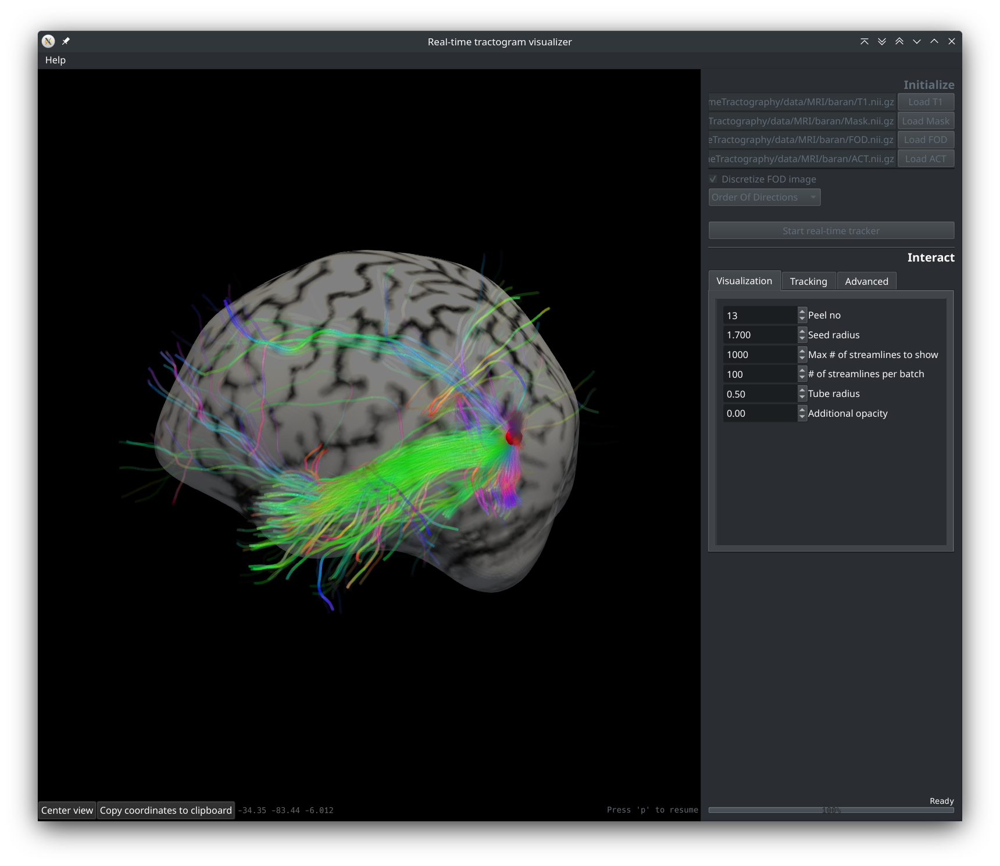

## Dependencies
1. CMake (min version 3.15)
2. gcc-8 or newer
3. libzip
4. QT5 or newer
5. VTK7 or newer (installed with QT support)
6. ACVD [(https://github.com/valette/ACVD/tree/83f7c05a7b3ccf0445708cea918b4b11325fb229)](https://github.com/valette/ACVD/tree/83f7c05a7b3ccf0445708cea918b4b11325fb229)
7. Trekker [(https://github.com/dmritrekker/trekker)](https://github.com/dmritrekker/trekker)

Notes on dependency installation:
- You will need to install QT, VTK, ACVD and Trekker manually from source. Please follow the instructions below.
- Please first install QT with *WebEngine, WebChannel, WebSockets, WebView, Positioning*.
- Then VTK should be installed with QT support.
- Then install ACVD. ACVD recently went through an update and the latest update is not yet supported by real-time tractogram visualizer. Please use the above link when installing ACVD (commit #83f7c05).
- Lastly, compile Trekker.

## Installation of rttvis

Edit and run the `build.sh` file. This will make a clean install by replacing the existing `build` folder.

Executable will be generated under the `build/bin` directory.

## How to use rttvis

Provide the four necessary input images listed below. Make sure that all images are in the same RASMM space based on the NIFTI sform convention.

1. **T1**: T1-weighted MRI image of the subject
2. **Mask**: Brain mask image. For example the mask generated by FSL eddy during the diffusion MRI preprocessing step can be used.
3. **FOD**: Fiber orientation distribution image. Trekker accepts for example MRtrix generated FODs. More information on the FOD format can be found [here](https://dmritrekker.github.io/manual/trekker.html#tracking-options).
4. **ACT**: rttvis performs anatomically constraint tractography using Trekker's pathway rules. With this, generated streamlines: (i) do not end inside the white-matter, and (ii) they do not cross corticospinal fluid. Currently there is no option to disable this and an ACT image has to be provided. The ACT image basically consists of only 4 numbers. There are -1, 0, 1 and 2. Outside the brain is -1. Corticospinal fluid is 0. White matter is 1. Gray matter is 2. If you had run the Freesurfer pipeline and have an aparc+aseg image, you can use the Python tool [here](https://raw.githubusercontent.com/dmritrekker/trekker/master/extensions/tools/aparc%2Baseg_to_trekkerACTlabels.py) to obtain the ACT image.

Different processing pipelines might have different conventions for FOD directions. You can use the `Order Of Direction` option to vary the direction as you wish. By default XYZ is assumed (no change). A lower case can be used to switch the direction, e.g., xYZ switches the sign of the first component. The order of components can be changed as well, e.g., yXz switches the sign of the second component while replacing it with the first, at the same time the sign of the last component is also changed.

By default spherical harmonics coefficients are converted to a discretized spherical function to increase the tracking speed. If desired this can be turned off.

Tractography parameters are explained in [Trekker's web-site](https://dmritrekker.github.io).

ENJOY!

Please contact by e-mail for questions.

## Contact
Dogu Baran Aydogan, PhD | (<baran.aydogan@uef.fi>)  
-Research Director (Assist. Prof.) @ A.I. Virtanen Inst. for Molecular Sciences, Uni. of Eastern Finland (UEF)  
-Research Fellow @ Dept. of Neuroscience and Biomedical Eng., Aalto Uni.
